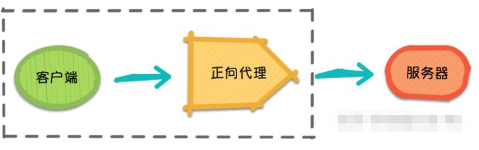
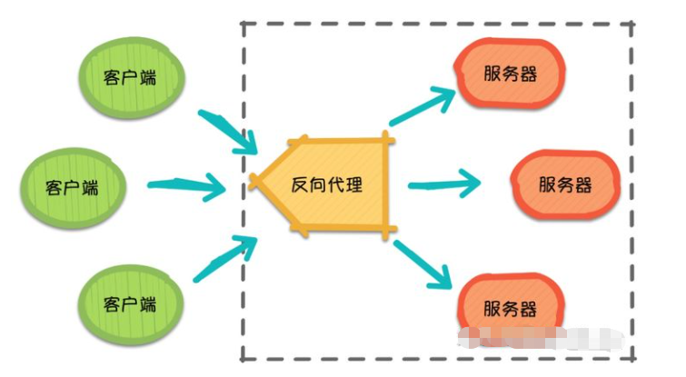

### 一、什么是负载均衡

​		**负载均衡**（Load Balance），它在网络现有结构之上可以提供一种廉价、有效、透明的方法来扩展网络设备和服务器的带宽，并可以在一定程度上增加吞吐量、加强网络数据处理能力、提高网络的灵活性和可用性等。用官网的话说，它充当着网络流中“交通指挥官”的角色，“站在”服务器前处理所有服务器端和客户端之间的请求，从而最大程度地提高响应速率和容量利用率，同时确保任何服务器都没有超负荷工作。如果单个服务器出现故障，负载均衡的方法会将流量重定向到其余的集群服务器，以保证服务的稳定性。当新的服务器添加到服务器组后，也可通过负载均衡的方法使其开始自动处理客户端发来的请求。

​		简言之，**负载均衡**实际上就是**将大量请求进行分布式处理的策略**。

### 二、Nginx 负载均衡

正向代理是帮客户端代理，反向代理是帮服务端代理

#### 1、正向代理

正向代理（Forward Proxy）最大的特点是，客户端非常明确要访问的服务器地址，它代理客户端，替客户端发出请求。

例如：翻墙

​		假设客户端想要访问 Google，它明确知道待访问的服务器地址是 [https://www.google.com/](https://link.zhihu.com/?target=https%3A//www.google.com/)，但由于条件限制，它找来了一个能够访问到 Google 的”朋友”：代理服务器。客户端把请求发给代理服务器，由代理服务器代替它请求 Google，最终再将响应返回给客户端。这便是一次正向代理的过程，该过程中服务器并不知道真正发出请求的是谁。

#### 2、反向代理

​		随着请求量的爆发式增长，服务器觉得自己一个人始终是应付不过来，需要兄弟服务器们帮忙，于是它喊来了自己的兄弟以及代理服务器朋友。此时，来自不同客户端的所有请求实际上都发到了代理服务器处，再由代理服务器按照一定的规则将请求分发给各个服务器。

​		这就是**反向代理**（Reverse Proxy），反向代理**隐藏了服务器的信息**，它代理的是服务器端，代其接收请求。换句话说，反向代理的过程中，客户端并不知道具体是哪台服务器处理了自己的请求。如此一来，既提高了**访问速度**，又为**安全性**提供了保证。

​		在这之中，反向代理需要考虑的问题是，如何进行**均衡分工**，**控制流量**，避免出现局部节点负载过大的问题。通俗的讲，就是如何为每台服务器合理的分配请求，使其整体具有更高的**工作效率**和**资源利用率**。

​		Nginx 作为一个基于 C 实现的高性能 Web 服务器，可以通过系列算法解决上述的负载均衡问题。并且由于它具有**高并发**、**高可靠性**、**高扩展性**、开源等特点，成为开发人员常用的反向代理工具。

### 三、负载均衡常用算法

#### 1、轮询（round-robin）

​		轮询为负载均衡中较为基础也较为简单的算法，它不需要配置额外参数。假设配置文件中共有n台服务器，该算法遍历服务器节点列表，并按节点次序每轮选择一台服务器处理请求。当所有节点均被调用过一次后，该算法将从第一个节点开始重新一轮遍历。

​		**特点**：由于该算法中每个请求按时间顺序逐一分配到不同的服务器处理，因此**适用于服务器性能相近的集群**情况，其中每个服务器承载相同的负载。但对于服务器性能不同的集群而言，该算法**容易引发资源分配不合理等问题**。

#### 2、加权轮询

​		为了避免普通轮询带来的弊端，加权轮询应运而生。在加权轮询中，每个服务器会有各自的 `weight`。一般情况下，`weight` 的值越大意味着该服务器的性能越好，可以承载更多的请求。该算法中，客户端的请求按权值比例分配，当一个请求到达时，优先为其分配权值最大的服务器。

​		**特点**：加权轮询可以应用于服务器性能不等的集群中，使资源分配更加合理化

#### 3、IP哈希（IP hash）

​		`ip_hash` 依据发出请求的客户端 IP 的 hash 值来分配服务器，该算法可以保证同 IP 发出的请求映射到同一服务器，或者具有相同 hash 值的不同 IP 映射到同一服务器。

​		**特点**：该算法在一定程度上解决了集群部署环境下 Session 不共享的问题。

​		实际应用中，我们可以利用 `ip_hash`，将一部分 IP 下的请求转发到运行新版本服务的服务器，另一部分转发到旧版本服务器上，实现灰度发布。再者，如遇到文件过大导致请求超时的情况，也可以利用 `ip_hash` 进行文件的分片上传，它可以保证同客户端发出的文件切片转发到同一服务器，利于其接收切片以及后续的文件合并操作。

#### 4、其他算法

- URL hash
  - `url_hash` 是根据请求的 URL 的 hash 值来分配服务器。该算法的特点是，相同 URL 的请求会分配给固定的服务器，当存在缓存的时候，效率一般较高。然而 Nginx 默认不支持这种负载均衡算法，需要依赖第三方库。
- 最小连接数（Least Connections）
  - 假设共有n台服务器，当有新的请求出现时，遍历服务器节点列表并选取其中连接数最小的一台服务器来响应当前请求。连接数可以理解为当前处理的请求数。

