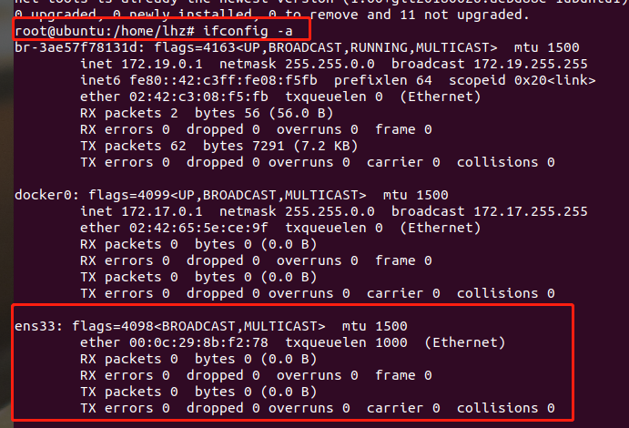

### 一、Linux_Ubuntu中ens33没有ip

换了一个网络后（家里和公司不同网络），打开电脑虚拟机Ubtuntu连接不上网络，在Ubtun上发现 ens33 这个网卡根本没有分配ip。



为ens33分配ip地址。

```bash
sudo dhclient ens33    # 为ens33分配ip地址。
sudo ifconfig ens33 # 重新查看ens33网卡是否分配ip

# 可以看到ens33已经分配ip了
ens33: flags=4163<UP,BROADCAST,RUNNING,MULTICAST>  mtu 1500
        inet 192.168.2.133  netmask 255.255.255.0  broadcast 192.168.2.255
        inet6 fe80::20c:29ff:fe8b:f278  prefixlen 64  scopeid 0x20<link>
        ether 00:0c:29:8b:f2:78  txqueuelen 1000  (Ethernet)
        RX packets 18  bytes 2201 (2.2 KB)
        RX errors 0  dropped 0  overruns 0  frame 0
        TX packets 60  bytes 7162 (7.1 KB)
        TX errors 0  dropped 0 overruns 0  carrier 0  collisions 0

```


如果你每次重启系统之后，使用ifconfig命令又看不到IP地址了，必须每次都使用 dhclient ens33 命令重新分配的话,可以用下面方法

在路径 /etc/profile.d 下放入 sh脚本

```shell
sudo dhclient ens33
```


