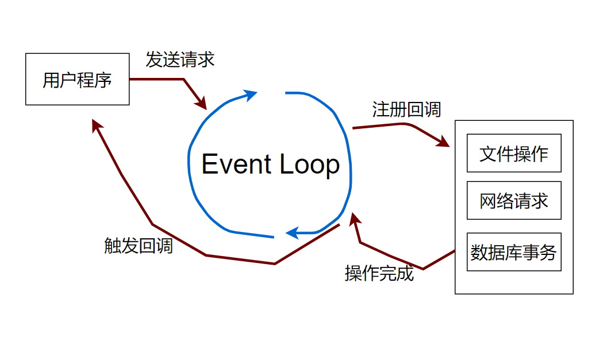

## Node.js的进程

#### 什么是进程？

进程是操作系统分配资源的最小单位

但这不是定义，真正的定义是：**进程是应用程序的执行副本**。

启动应用程序：应用程序（磁盘） --> 进程（内存中）

在这个过程中，操作系统要给进程分配资源，这些资源包括：

- 用户和组（哪个用户、组启动的进程）
- 目录资源
  - 进程的工作目录
  - 进程的可见目录
- 文件资源
  - 设备资源
  - 网络资源
  - 数据文件
  - 代码文件
  - …………
- 主线程

> 注意：进程不能执行程序！---执行程序的是现场。操作系统会为每个进程分配一个主线程，然后进程还可以分配其他线程。

NodeJS的进程也是进程，进程下可以有很多线程。进程是Node引擎的执行副本，是操作系统分配资源的最小单位。Node下有很多线程一起完成执行程序的工作

- Node进程也有主线程
- Node进程也可以使用多线程（只不过不允许用户用）
- Node进程有工作目录
- Node进程可以拥有文件资源

总之，操作系统给进程的，Node进程也都能享受，操作系统不给进程的Node进程也没有。从这个层面看，Node进程、Java进程、Python进程没有本质区别

## Node.js的线程模型

进程是分配资源的，线程是执行程序的。

**为什么，不既分配资源，也执行程序，统一线程和进程？**

因为进程需要的资源多，线程需要的资源少。线程只需要执行程序相关的资源：

- 程序计数器（执行到哪一行）
- 栈（存储执行程序的中间结果）
- 寄存器（辅助计算以及控制）

**形象的说，创建进程是秒级的，创建线程是ms级的。**

所以，Node.js是**单进程**吗？

**没有单进程**这个说法，只有单线程。进程作为应用的执行副本，本身就是一个完整实体，也没有多进程这种说法。

**Node.js是单线程吗？**

Node.js进程不是单线程的，内部有很多线程。用户写的Node.js程序值在一个线程中执行。

线程的本质是抽象要并发做的事情，比如说：

- 浏览器渲染
- 用户操作页面
- 发送网络请求

这3件事情，用3个线程来表达，看上去这3件事情就可以同时被完成，这就是并行的能力。

Node.js每遇到一件需要操作系统支持的事情，就会使用一个单独的线程。比如说：

- 读取文件
- 发送网络请求
- 定时器
- ……

为了防止线程太多，Node.js内部有一个线程池，用于处理需要OS支持的行为。

对于用户的程序，Node.js也用一个单独的线程。

那么Node.js为什么不让单线程执行所有程序呢？ ---因为它需要并发

#### 方案：基于事件循环

浏览器是这样的吗？ —— 当然是一样的工作原理。

所以核心是：Event Loop。 Event Loop是什么？

- Event Loop是一个单线程程序
- Event Loop是驱动javascript程序执行的动力源

将下面的程序带入Event Loop帮助你思考：

- setTimeout
- requestAnimationFrame
- setInterval
- new Promise(...)

