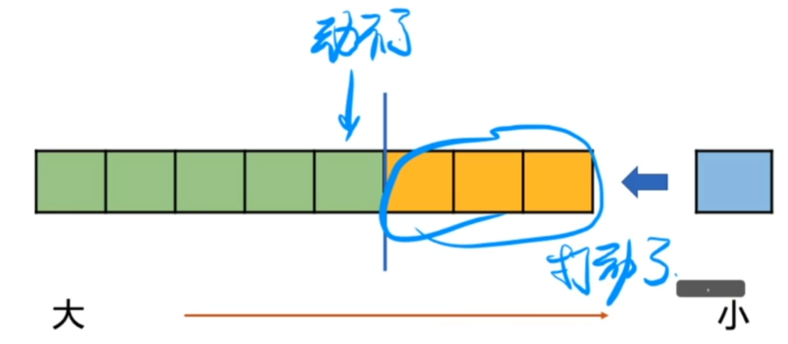

# 问题引入

给一个序列，求序列中，每个元素左侧，第一个小于它的元素

观察单调队列的逻辑模型，每个黄色元素左侧第一个小于它的元素，是前一个黄色元素，根据入队过程中，每一个元素都【黄】过，那么将所有元素依次入队，当前元素在队列中的前一个元素，即是问题所求。

这种不从头部出的结构，我们叫他【单调栈】

|  0   |     1     |  2   |  3   |     4     |  5   |     6     |     7      |
| :--: | :-------: | :--: | :--: | :-------: | :--: | :-------: | :--------: |
|  3   | **《1》** |  4   |  5   | **《2》** |  9   | **《8》** | **《12》** |

单调栈：不从头部出数据的单调队列。

所有被我（新入栈的元素）打动了（踢出去的元素）的，是什么？我是他们的男神

那个我打动不了（踢不出去）的，是什么？ 她是我的女神

在单调栈中，我（新入栈的元素）是后面入栈中，最近的一个比他们（黄色方块）大的元素

单调递增：维护最近小于关系

单调递减：维护最近大于关系

